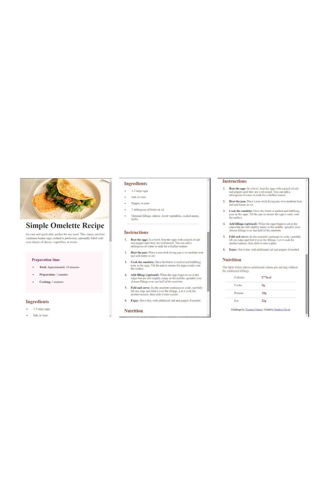

# Frontend Mentor - Recipe page solution

This is a solution to the [Recipe page challenge on Frontend Mentor](https://www.frontendmentor.io/challenges/recipe-page-KiTsR8QQKm). Frontend Mentor challenges help you improve your coding skills by building realistic projects. 

## Table of contents

- [Overview](#overview)
  - [The challenge](#the-challenge)
  - [Screenshot](#screenshot)
  - [Links](#links)
- [My process](#my-process)
  - [Built with](#built-with)
  - [What I learned](#what-i-learned)
  - [Continued development](#continued-development)
- [Author](#author)

## Overview

### Screenshot
Desktop View


Mobile View




### Links

- Solution URL: [My Solution](https://github.com/BANKOLEDO/recipe-page-main)
- Live Site URL: [Page Preview](https://bankoledo.github.io/recipe-page-main/)

## My process

### Built with

- Semantic HTML5 markup
- CSS custom properties
- Flexbox
- Mobile-first workflow


### What I learned
 Great work on the recipe page project! Here's a summary of what you learned with code snippets and a continued development section:

---

## What I Learned

1. **CSS Variables**:
    - **Example**: Defined a consistent color palette using CSS variables, making the design easily maintainable and scalable.
    ```css
    :root {
        --nutmeg: hsl(14, 45%, 36%);
        --dark-Raspberry: hsl(332, 51%, 32%);
        --white: hsl(0, 0%, 100%);
        --rose-white: hsl(330, 100%, 98%);
        --eggshell: hsl(30, 54%, 90%);
        --light-grey: hsl(30, 18%, 87%);
        --wenge-brown: hsl(30, 10%, 34%);
        --dark-charcoal: hsl(24, 5%, 18%);
    }
    ```

2. **Responsive Design with Media Queries**:
    - **Example**: Adjusted layout for larger screens using media queries.
    ```css
    @media (min-width: 600px) {
        .entire-page {
            width: 100vw;
            background-color: var(--eggshell);
            display: flex;
            flex-direction: column;
            align-items: center;
        }

        .header-img {
            align-self: center;
            width: 90%;
            border-radius: 0.6rem;
        }

        .page-container {
            border-radius: 1rem;
            display: flex;
            flex-direction: column;
            margin-top: 6rem;
            width: 45%;
            padding: 2rem 0.4rem;
            background-color: var(--white);
        }

        .hr {
            width: 90%;
        }
    }
    ```

3. **Typography and Spacing**:
    - **Example**: Managed font sizes, line heights, and spacing for a clean and readable design.
    ```css
    .header {
        color: var(--dark-charcoal);
        font-size: 2.6rem;
        line-height: 2.5rem;
        padding: 0.6rem 0.4rem 0.6rem 2rem;
    }

    .about-dish {
        line-height: 1.3rem;
        font-weight: 500;
        color: var(--wenge-brown);
        padding: 0.5rem 0.4rem 0.6rem 2rem;
        margin-bottom: 2rem;
    }
    ```

4. **Flexbox for Layout**:
    - **Example**: Used Flexbox to create a flexible layout for various elements.
    ```css
    .row {
        display: flex;
        justify-content: center;
        margin-bottom: 1rem;
    }

    .name {
        flex-grow: 1;
        margin-left: 6rem;
        color: var(--wenge-brown);
        font-weight: 550;
        opacity: 0.8;
    }

    .data {
        flex-grow: 2;
        color: var(--dark-Raspberry);
        font-weight: 800;
    }
    ```

### Continued Development

1. **Advanced CSS Techniques**:
    - Explore CSS animations and transitions to add more dynamic interactions to the recipe page.
    - Experiment with CSS Grid for more complex layouts and compare it with Flexbox to understand their strengths and use cases.

2. **JavaScript Enhancements**:
    - Integrate JavaScript to make the recipe page interactive, such as dynamically fetching recipe data from an API.
    - Add functionality to switch between different recipes on the same page.

3. **Accessibility Improvements**:
    - Ensure the design is fully accessible by adding appropriate ARIA labels and roles.
    - Test the recipe page with screen readers and make necessary adjustments to improve accessibility.

4. **Performance Optimization**:
    - Optimize images and other assets to improve the loading speed of the recipe page.
    - Implement best practices for CSS and HTML to enhance performance and reduce page load time.

5. **Advanced Responsive Design**:
    - Learn and apply advanced responsive design techniques, such as responsive typography and container queries.
    - Explore modern CSS layout techniques like CSS Subgrid for more refined control over grid layouts.


## Author

- GitHub - [GitHub](https://github.com/BANKOLEDO)
- Frontend Mentor - [@BANKOLEDO](https://www.frontendmentor.io/profile/BANKOLEDO)
- Twitter - [@bankydavid12](https://www.twitter.com/bankydavid12)


